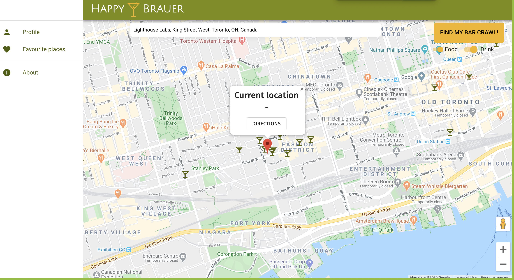

# Happy Brauer
A web application that finds a user's nearest happy hours in Toronto. This web app uses Google Maps API and Google Directions API. It was built using ReactJS on the front-end, Node.JS on the backend and PostGreSQL for the database. This was part of a final project of the Web Development bootcamp in Lighthouse Labs. 
In Happy Brauer, once logged in a user will be redirected to the map with happy hours. The map will be centered on a user's current location, or go to a default location. A user can:
* Search for a custom location
* Find their nearest happy hour locations (indicated with customized markers)
* Get directions to a restaurant or bar
* Toggle on and off restaurants or bars for drinks or food only.
* Generate a barcrawl based on the user's current location and time. 

# Final Product

